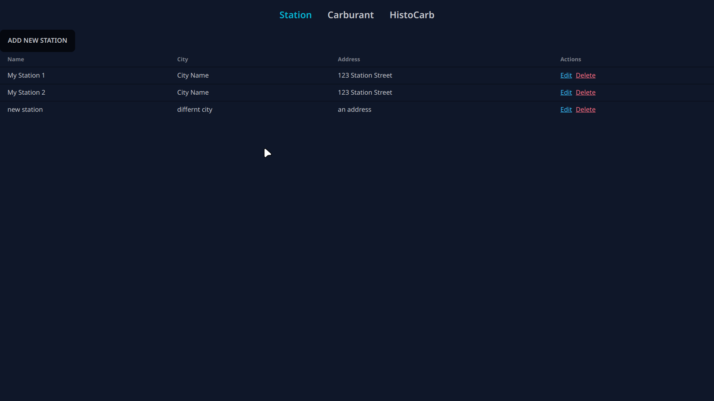
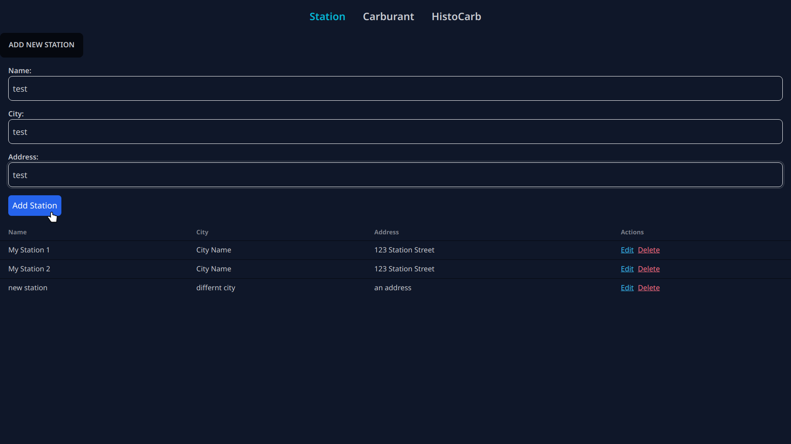
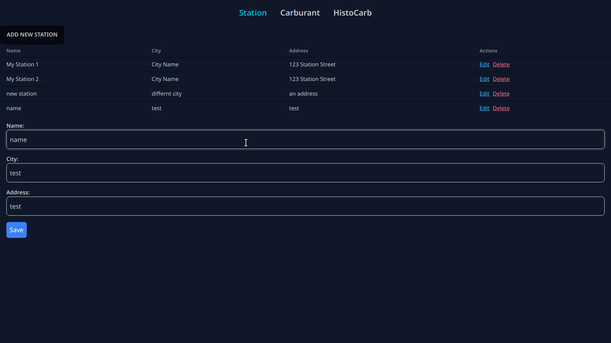
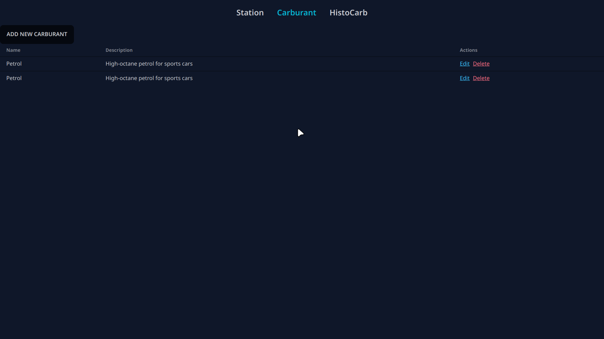
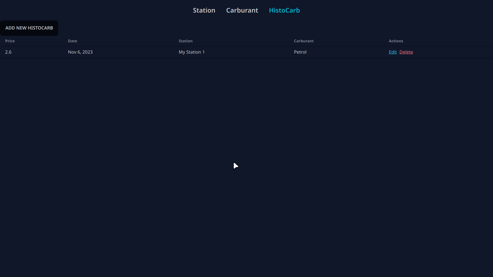

# FuelMaster Web Application

FuelMaster is a web application that allows you to manage fuel stations, their fuel prices, and related information. This application provides a user-friendly interface for CRUD (Create, Read, Update, Delete) operations on fuel stations, types of fuel (carburants), and daily fuel prices (histocarbs). It's built using Spring Boot for the backend and Angular for the frontend.

## Features

- Create, Read, Update, and Delete (CRUD) operations for fuel stations.
- CRUD operations for carburants (types of fuel).
- CRUD operations for daily fuel prices (histocarbs) with associated fuel stations and carburants.
- Responsive and user-friendly interface.

## Technologies Used

- Spring Boot
- Angular
- MySQL
- Tailwind CSS and DaisyUI for styling

## Screens

